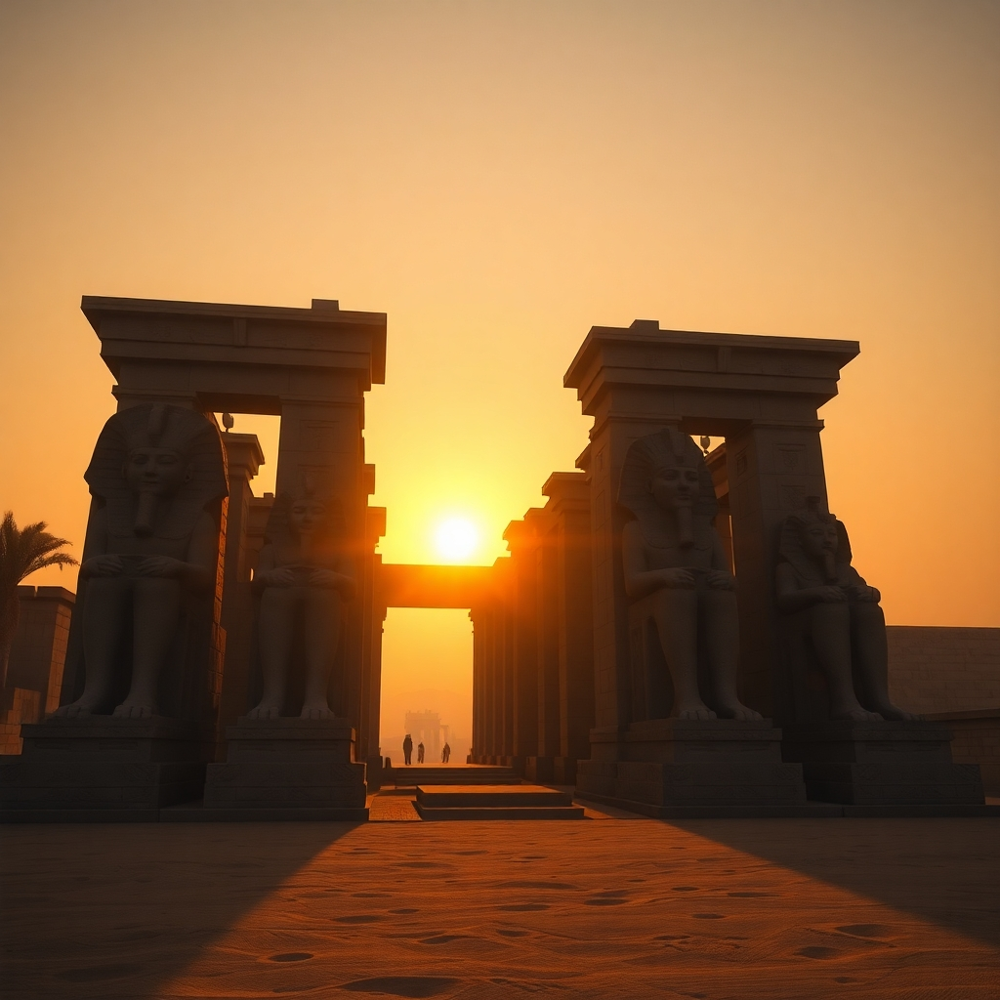

# مقالاتي (My Articles) - ASP.NET Core Blog Platform


## 📝 Overview

**مقالاتي** (My Articles) is a modern, feature-rich blogging platform built with ASP.NET Core. It provides a seamless experience for content creators and readers with a focus on Arabic content. The platform supports multiple authors, categorized articles, and a responsive design with dark mode support.

## ✨ Features

- **Multi-author Support**: Allow multiple authors to create and manage their content
- **Category Management**: Organize articles by categories
- **Responsive Design**: Fully responsive layout that works on all devices
- **Dark Mode**: Built-in dark mode with smooth transitions and system preference detection
- **User Authentication**: Secure user registration and authentication system
- **Admin Dashboard**: Comprehensive admin panel for content management
- **Rich Text Editing**: Advanced editor for creating beautiful articles
- **Search Functionality**: Search articles by title, content, or category
- **Pagination**: Efficient pagination for article listings
- **SEO Friendly**: Optimized for search engines
- **RTL Support**: Full right-to-left language support for Arabic content

## 🛠️ Technology Stack

- **Backend**: ASP.NET Core 9.0
- **Database**: SQL Server with Entity Framework Core
- **Frontend**: HTML5, CSS3, JavaScript, Bootstrap 5
- **Authentication**: ASP.NET Core Identity
- **Image Processing**: SixLabors.ImageSharp
- **Architecture**: Clean architecture with Core, Data, and Web layers

## 🏗️ Project Structure

The solution follows a clean architecture approach with three main projects:

- **ArticalProject**: The main web application (ASP.NET Core MVC)
- **ArticalProject.Core**: Contains domain models and business logic
- **ArticalProject.Data**: Data access layer with Entity Framework Core

## 🚀 Getting Started

### Prerequisites

- .NET 9.0 SDK or later
- SQL Server (Local or Express)
- Visual Studio 2022 or later (recommended)

### Installation

1. Clone the repository

   ```bash
   git clone https://github.com/isaac-melad/Articalproject.git
   cd Articalproject
   ```

2. Update the connection string in `appsettings.json` to point to your SQL Server instance

3. Apply database migrations

   ```bash
   dotnet ef database update
   ```

4. Run the application

   ```bash
   dotnet run
   ```

5. Navigate to `https://localhost:44304` in your browser

## 📸 Screenshots

### Home Page


### Article View


### Admin Dashboard


### Dark Mode


### Article Categories



## 🧩 Key Components

### Controllers

- **HomeController**: Handles the main site navigation and article display
- **AuthorController**: Manages author profiles and information
- **AuthorPostController**: Handles article creation, editing, and deletion
- **CategoryController**: Manages article categories
- **AdminController**: Provides administrative functionality

### Models

- **Author**: Represents content creators with profiles
- **AuthorPost**: The main article model with content and metadata
- **Category**: Classification system for articles

### Features in Detail

#### Dark Mode

The application includes a sophisticated dark mode implementation with:

- System preference detection
- Manual toggle with animation effects
- Persistent user preference storage
- Smooth transitions between themes

#### Multi-language Support

The platform is built with Arabic as the primary language, featuring:

- RTL layout direction
- Arabic-friendly typography
- Culturally appropriate design elements

## 🤝 Contributing

Contributions are welcome! Please feel free to submit a Pull Request.

## 📄 License

This project is licensed under the MIT License - see the LICENSE file for details.

## 📞 Contact

Isaac Melad - [GitHub Profile](https://github.com/isaac-melad)

---

<p align="center">Made with ❤️ for Arabic content creators</p>
